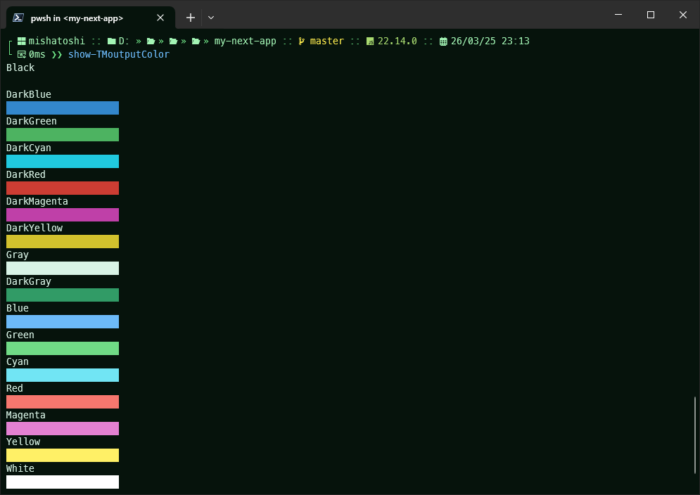

<div align="center">
  
  <h1>Mojito Pro for Windows Terminal, PowerShell and CMD</h1>
  <h3>🍃 Easy on the eyes, boosting productivity!</h3>
</div>

<div align="center">
  
</div>

## Getting started

> You can download and install the **Windows Terminal** [https://github.com/microsoft/terminal](https://github.com/microsoft/terminal)
>

## ⚙️ Installation

### I. Windows Terminal

Start **Windows Terminal** and click on the down arrow symbol `˅` from menu bar. This will open a drop down menu from which select **Settings** option. Alternatively use `Ctrl + ,` to open **Settings** directly.

In the `settings.json` settings file for **Windows Terminal**, find the `schemes` section and paste the content of [Mojito Pro](https://raw.githubusercontent.com/mishatoshi/mojito-pro-windows-terminal/master/mojito-pro.json)

Example:

```json
"schemes": [
  // Paste the content
]
```

#### Activate

Once the color scheme has been defined, it's time to enable it. Find the `profiles` section and add a `colorScheme` value to the default profile.

Example:

```json
"profiles": {
    "defaults": {
        "colorScheme": "Mojito Pro"
    }
}
```

### II. PowerShell and CMD

1. **PSReadLine 2.0** or later. It's installed by default in Windows 10/11, but you'll most likely [need to upgrade it](https://github.com/lzybkr/PSReadLine#user-content-upgrading). You can verify your **PSReadLine** version by running `(Get-Module PSReadLine).Version.Major`.
1. Go to [microsoft/terminal ColorTool](https://github.com/Microsoft/Terminal/tree/main/src/tools/ColorTool#installing). Download the **ColorTool** release and extract the zip file.
1. Download [Mojito Pro](https://github.com/mishatoshi/mojito-pro-windows-terminal/blob/master/ColorTool%20Schemes/mojito-pro.ini) (Download raw file) and paste to the unzipped `ColorTool/schemes` directory.

1. Open **PowerShell**, navigate to the **ColorTool** directory and run:

    ```PowerShell
    ./ColorTool -b ./schemes/mojito-pro.ini
    ```

1. Include this [powershell configuration](./Microsoft.PowerShell_profile.ps1) in your **PowerShell** `$PROFILE` file.

1. Right-click on the window titlebar and choose **Properties**, click **OK** to save.

## Installing additional features

1. [Oh My Posh](https://ohmyposh.dev). A prompt theme engine for any **shell**.

1. [Terminal-Icons](https://github.com/devblackops/Terminal-Icons). A **PowerShell** module to show file and folder icons in the terminal.

1. [PSReadLine](https://docs.microsoft.com/en-us/powershell/module/psreadline/about/about_psreadline?view=powershell-7.2). Provides an improved command-line editing experience in the **PowerShell**.

## Other versions

* Oh My Posh [https://github.com/mishatoshi/mojito-pro-oh-my-posh-theme](https://github.com/mishatoshi/mojito-pro-oh-my-posh-theme)
* Visual Studio Code [https://github.com/mishatoshi/mojito-pro-vscode-theme](https://github.com/mishatoshi/mojito-pro-vscode-theme)
* Flow Launcher [https://github.com/mishatoshi/mojito-pro-flowlauncher-theme](https://github.com/mishatoshi/mojito-pro-flowlauncher-theme)

## License

[MIT License](./LICENSE)

<h3 align="center">Don’t worry, be happy😍</h3>
